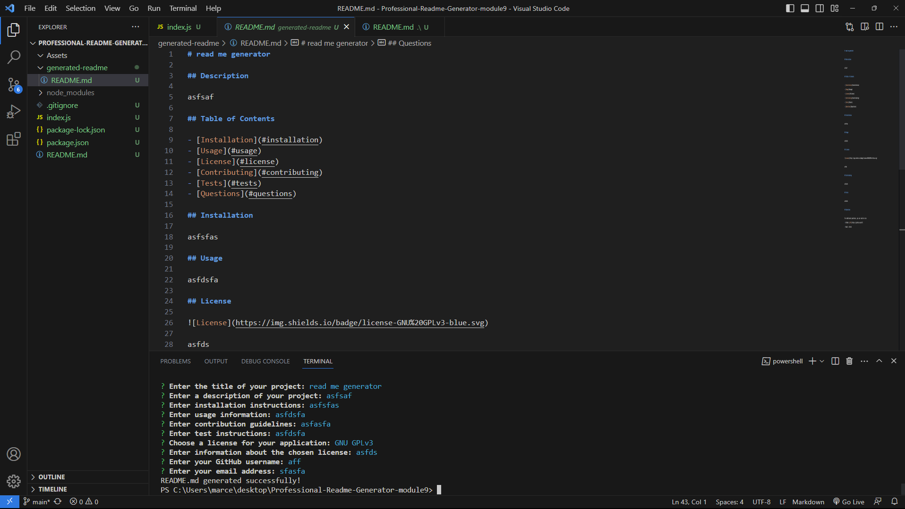

# Professional-Readme-Generator-Module9

## Description

This is a professional README generator project. It generates a README file based on user input, providing all the necessary sections like project description, installation instructions, usage information, contributing guidelines, tests, and license information. The generated README file will be generated in the generated-readme folder.

walktrough video: https://drive.google.com/file/d/1GGO45t2DKcgIgGJHFVMoP3_MC90r6cdZ/view

### Credits

Completion of the project was done with the help of Tutors